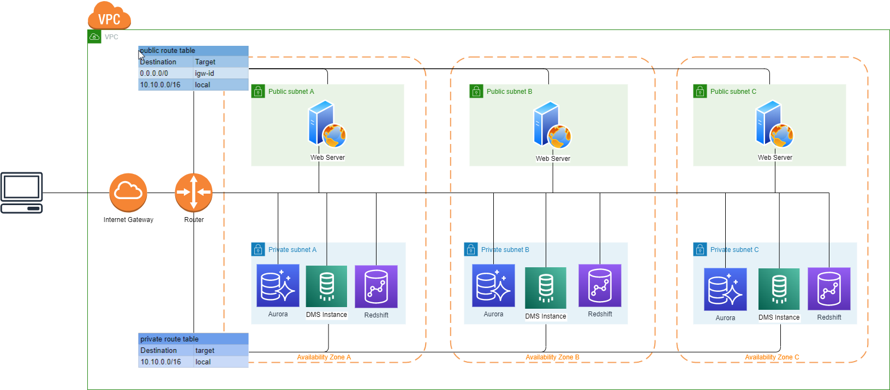

# pre request

- install node: https://nodejs.org/en/
- install serverless framework: https://www.npmjs.com/package/serverless

# Architercure



# create deploy bucket

create a bucket with name 'com.${bucketNamePrefix}.deploy-bucket', bucketNamePrefix can be any value, you decide

# deploy vpc

update vpc.xml resources:Parameters:MyIP to your own ip address
update vpc.xml custom:bucketNamePrefix to your bucketNamePrefix

```
sls deploy -c vpc.yml
```

# deploy aurora

update aurora.xml custom:bucketNamePrefix to your bucketNamePrefix

```
sls deploy -c aurora.yml
```

# deploy redshift

update redshift.xml custom:bucketNamePrefix to your bucketNamePrefix

```
sls deploy -c redshift.yml
```

# deploy dms

```
sls deploy -c dms.yml
```

# insert data to aurora

- connect to aurora
- create table and insert data

```
CREATE TABLE person (
    person_id int,
    last_name varchar(255),
    first_name varchar(255),
    ciry varchar(255)
);
INSERT INTO person VALUES (1, 'win', 'jessica', 'sh');
```

# sync data from aurora to redshift

- run dms database migration task
- check redshift with redshift query editor
