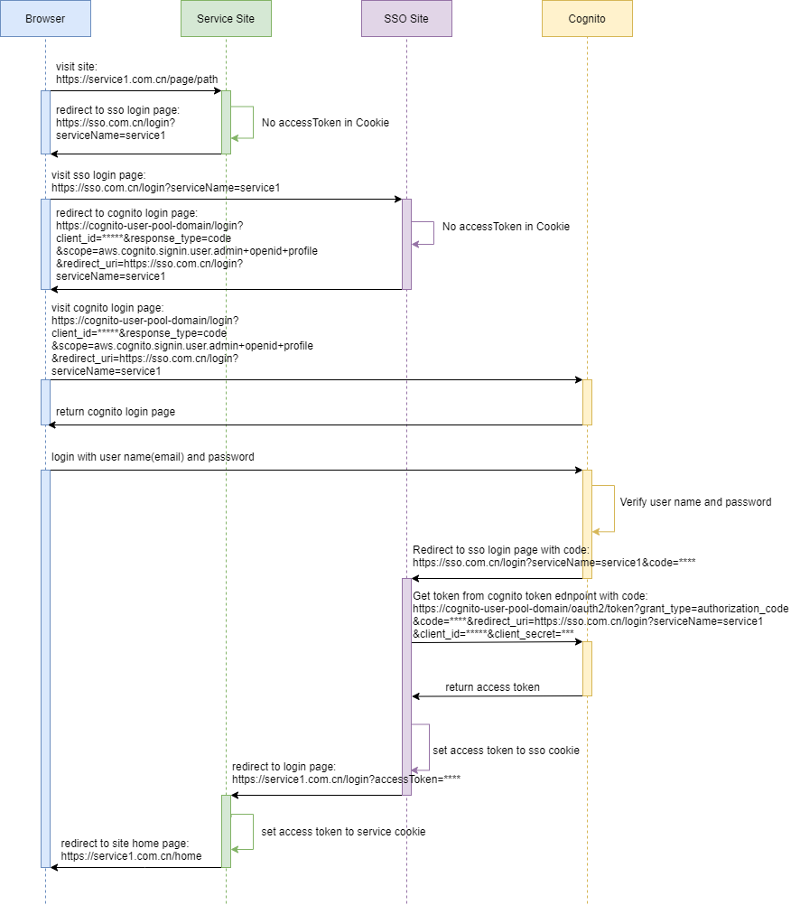
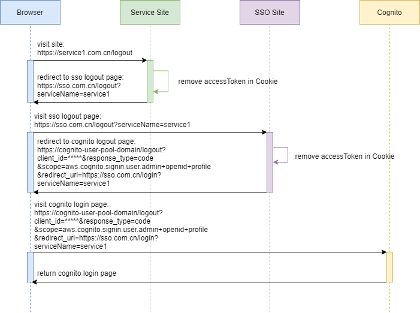
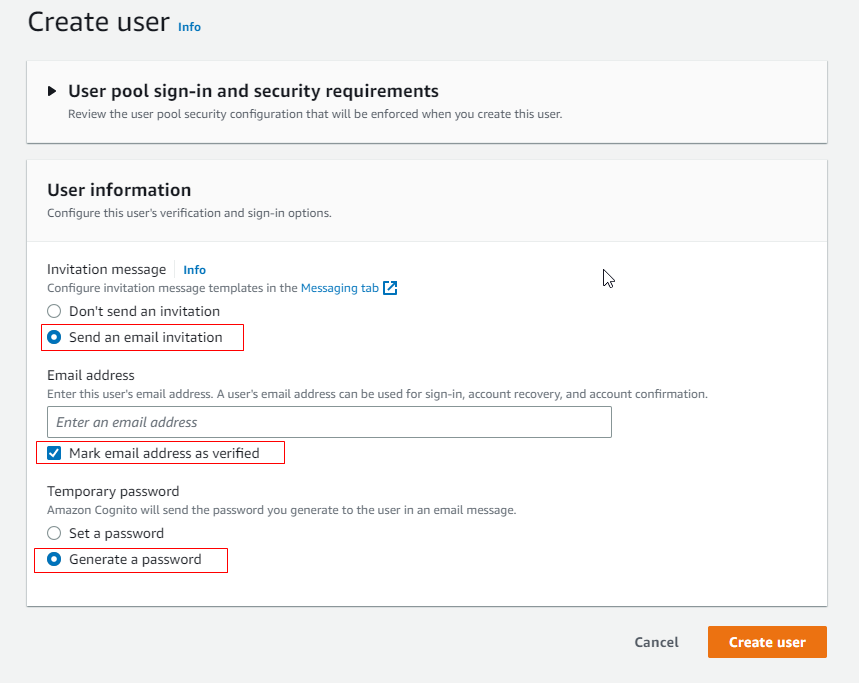

# Cross Domain SSO Workflow

## Login workflow



## Logout workflow



# Deploy

## Create deploy bucket

replac the ${bucketNamePrefix} to any value for ParameterValue=${bucketNamePrefix} in below command, bucketNamePrefix can be any value, you decide, eg. ParameterValue=jessica

```
aws cloudformation create-stack --stack-name deploy-bucket-setup --template-body file://./deploy-bucket.yml --parameters ParameterKey=bucketNamePrefix,ParameterValue=${bucketNamePrefix} --region ap-southeast-1
```

## Deploy cognito

- update cognito.xml custom:bucketNamePrefix to your bucketNamePrefix
- we have below config in cognito.yml, so the default domain name is test-jessica-auth, you can change as you like

```
    CognitoUserPoolDoamin:
      Type: AWS::Cognito::UserPoolDomain
      Properties:
        Domain: test-jessica-auth
        UserPoolId: !Ref CognitoUserPool
```

```
sls deploy -c cognito.yml
```

## Create user in cognito user pool

create a user with the [aws web console](https://ap-southeast-1.console.aws.amazon.com/cognito/v2/idp/user-pools?region=ap-southeast-1)
choose `Send an email invitation`, input your email, check `Mark email address as verified`, choose `Generate a password`


after create the user, you can check your email to get the initial password.

# Update host file

for windows, find host file in c:\Windows\System32\Drivers\etc\hosts, add following lines:

```
127.0.0.1 localhost.service1.com.cn
127.0.0.1 localhost.service2.com.cn
```

# Start sso service

1. Update src/main/resources/application.properties, set below fields, check the [aws web console](https://ap-southeast-1.console.aws.amazon.com/cognito/v2/idp/user-pools?region=ap-southeast-1) for userPoolId, clientId, clientSecret, UserPoolDomainName

```
cognito.userPoolId=
cognito.region=ap-southeast-1
cognito.userPoolDomain=https://${UserPoolDomainName}.auth.ap-southeast-1.amazoncognito.com
cognito.userPoolTokenUri=https://${UserPoolDomainName}.auth.ap-southeast-1.amazoncognito.com/oauth2/token

cognito.clientId.service1=
cognito.clientSecret.service1=

cognito.clientId.service2=
cognito.clientSecret.service2=
```

2. start sso service

```
cd simple-service-example-sso
mvn eclipse:eclipse
mvn spring-boot:run
```

# Start service1

```
cd simple-service-example-service1
mvn eclipse:eclipse
mvn spring-boot:run
```

# Start service2

```
cd simple-service-example-service2
mvn eclipse:eclipse
mvn spring-boot:run
```

# Test Login

1. Visit http://localhost.service1.com.cn:8081/home, you will see the login page, input email and the initial password, after set new password, will redirect to home page, check browser console: you can see the accessToken cookie
2. Visit http://localhost.service2.com.cn:8082/home, will open home page directly, no need to login again, you can see the accessToken cookie
3. Visit http://localhost:8080/login/test(this url is just used to check the cookie for sso service),check the browser console, you can see the accessToken cookie

# Test Logout

1. Visit http://localhost.service1.com.cn:8081/logout, the accessToken cookiet will be removed, will redirect to login page
2. Visit http://localhost.service1.com.cn:8081/home, will redirect to login page
3. Visit http://localhost.service2.com.cn:8082/home, will redirect to login page

# Test token expire

In current implementation, we set cognito accessToken expire time to 1 day, and cookie expire time also to 1 day, to test the accessToken expire case, you can set the cognito accessToken expire time to 5 minutes(the minimum value we can set), keep the cookie expire time also as 1 day, after login 5 minutes, when you refresh the home page, will redirect to login page again.

```
    CognitoUserPoolClient1:
      Type: AWS::Cognito::UserPoolClient
      Properties:
        AccessTokenValidity: 5
        ...
        TokenValidityUnits:
          AccessToken: minutes
        ...
```
