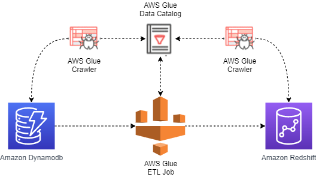
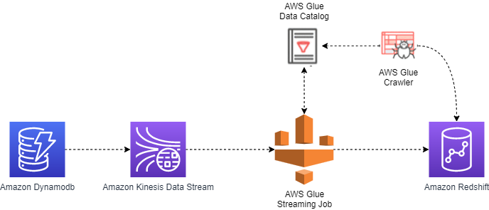

# pre request

- install node: https://nodejs.org/en/
- install serverless framework: https://www.npmjs.com/package/serverless

# create deploy bucket

replac the ${bucketNamePrefix} to any value for ParameterValue=${bucketNamePrefix} in below command, bucketNamePrefix can be any value, you decide, eg. ParameterValue=jessica

```
aws cloudformation create-stack --stack-name deploy-bucket-setup --template-body file://./deploy-bucket.yml --parameters ParameterKey=bucketNamePrefix,ParameterValue=${bucketNamePrefix} --region ap-southeast-1
```

# deploy vpc

update vpc.xml custom:bucketNamePrefix to your bucketNamePrefix

```
sls deploy -c vpc.yml
```

# deploy redshift

- For redshift to use glue job for data sync

  - redshift must `disable` public accessiable and in private subnet

- For redshift to use kinesis data firehose for data sync
  - redshift must `enable` public accessiable and in public subnet

update redshift.xml custom:bucketNamePrefix to your bucketNamePrefix

```
sls deploy -c redshift.yml
```

# deploy glue etl job

## architecture



## Tips

1.  glue connection must in `private subnet with nat gateway`: AWS Glue uses private IP addresses in the subnet when it creates elastic network interfaces in your specified virtual private cloud (VPC) and subnet.
    https://docs.aws.amazon.com/glue/latest/dg/troubleshooting-connection.html
2.  glue connection security group must have a [self-referencing rule to allow](https://docs.aws.amazon.com/glue/latest/dg/start-development-endpoint.html) to allow AWS Glue components to communicate. Specifically, add or confirm that there is a rule of Type All TCP, Protocol is TCP, Port Range includes all ports, and whose Source is the same security group name as the Group ID.
3.  [how to test glue connection](https://docs.aws.amazon.com/glue/latest/dg/console-test-connections.html): In the navigation pane, under Legacy pages, choose Connections (legacy). Select the check box next to the desired connection, and then choose Test connection.

## deploy command

```
cd glue-etl-job
sls deploy -c glue-etl.yml
aws s3 cp dynamodb-to-redshift.py s3://com.${self:custom.bucketNamePrefix}.glue-temp-bucket/script/
```

## test glue etl job

1. insert some data to dynamodb table with aws web console first, otherwise, the crawler can not detect the table scheme
2. run dynamodb-crawler, after run success, you can see the database and table in [glue console](https://ap-southeast-1.console.aws.amazon.com/glue/home?region=ap-southeast-1#catalog:tab=tables)
3. create redshift table with [Redshift query editor v2](https://ap-southeast-1.console.aws.amazon.com/sqlworkbench/home?region=ap-southeast-1#/client)

```
CREATE TABLE "public"."test_sync_to_redshift"(pk varchar(200) not null, sk varchar(200) NOT NULL, primary key(pk, sk));
```

4. run redshift-crawler, if encounter no valid connection error, please update password in the redshift-connection manually with aws console, don't know why the password is not correct when deploy with cloudformation. After run success, you can see the database and table in [glue console](https://ap-southeast-1.console.aws.amazon.com/glue/home?region=ap-southeast-1#catalog:tab=tables)

5. run glue etl job, after run success, you can check data in redshift table with [Redshift query editor v2](https://ap-southeast-1.console.aws.amazon.com/sqlworkbench/home?region=ap-southeast-1#/client).

This glue etl job will `insert all data in dynamodb table` to redshift table directly, as for redshift, [primary key, and foreign key constraints are informational only; they are not enforced by Amazon Redshift](https://docs.aws.amazon.com/redshift/latest/dg/t_Defining_constraints.html), so if you run the jon serval times, you will see duplicate data with some primary key in redshift table.

# deploy glue streaming job

For glue etl job, it will sync all data in the source dynamodb table to redshift table, with kinesis and glue streaming job, we can implement `increadingly data sync`.

## architecture



## tips

1.  glue connection must in `private subnet with nat gateway`: AWS Glue uses private IP addresses in the subnet when it creates elastic network interfaces in your specified virtual private cloud (VPC) and subnet.
    https://docs.aws.amazon.com/glue/latest/dg/troubleshooting-connection.html
2.  glue connection security group must have a [self-referencing rule to allow](https://docs.aws.amazon.com/glue/latest/dg/start-development-endpoint.html) to allow AWS Glue components to communicate. Specifically, add or confirm that there is a rule of Type All TCP, Protocol is TCP, Port Range includes all ports, and whose Source is the same security group name as the Group ID.
3.  [how to test glue connection](https://docs.aws.amazon.com/glue/latest/dg/console-test-connections.html): In the navigation pane, under Legacy pages, choose Connections (legacy). Select the check box next to the desired connection, and then choose Test connection.

## deploy command

```
cd glue-streaming-job
sls deploy -c glue-streaming.yml
aws s3 cp dynamodb-to-redshift-insert-catalog.py s3://com.${self:custom.bucketNamePrefix}.glue-streaming-temp-bucket/script/
aws s3 cp dynamodb-to-redshift-insert-jdbc.py s3://com.${self:custom.bucketNamePrefix}.glue-streaming-temp-bucket/script/
aws s3 cp dynamodb-to-redshift-upsert.py s3://com.${self:custom.bucketNamePrefix}.glue-streaming-temp-bucket/script/
```

Here we creat three glue jobs:

- dynamodb-to-redshift-glue-streaming-insert-only-catalog-job, this is to use glue catalog for redshift table, only support insert
- dynamodb-to-redshift-glue-streaming-insert-only-jdbc-job, this is to use glue connection for redshift table, only support insert
- dynamodb-to-redshift-glue-streaming-upsert-job, this is to use glue connection for redshift table, support borth insert and update by using [staging table](https://docs.aws.amazon.com/redshift/latest/dg/t_updating-inserting-using-staging-tables-.html)

## test glue streaming job

1. create redshift table with [Redshift query editor v2](https://ap-southeast-1.console.aws.amazon.com/sqlworkbench/home?region=ap-southeast-1#/client)

```
CREATE TABLE "public"."test_kinesis_sync_to_redshift"(pk varchar(200) NOT NULL, sk varchar(200) NOT NULL, value integer, updated_at timestamp without time zone, primary key(pk, sk));
```

2. run redshift-crawler, if encounter no valid connection error, please update password in the redshift-connection manually with aws console, don;t know why the password is not correct when deploy with cloudformation. After run success, you can see the database and table in [glue console](https://ap-southeast-1.console.aws.amazon.com/glue/home?region=ap-southeast-1#catalog:tab=tables)

3. run dynamodb-to-redshift-glue-streaming-insert-only-catalog-job, insert some data to dynamodb table with aws web console, after some time, you can check data in redshift table with [Redshift query editor v2](https://ap-southeast-1.console.aws.amazon.com/sqlworkbench/home?region=ap-southeast-1#/client), this job will insert newly added data to redshift table. Stop the job after confirm data sync is success.
4. run dynamodb-to-redshift-glue-streaming-insert-only-jdbc-job,insert some data to dynamodb table with aws web console, after some time, you can check data in redshift table with [Redshift query editor v2](https://ap-southeast-1.console.aws.amazon.com/sqlworkbench/home?region=ap-southeast-1#/client), this job will insert newly added data to redshift table. Stop the job after confirm data sync is success.
5. run dynamodb-to-redshift-glue-streaming-upsert-jdbc-job, insert some data to dynamodb table with aws web console, and update some existing data, after some time, you can check data in redshift table with [Redshift query editor v2](https://ap-southeast-1.console.aws.amazon.com/sqlworkbench/home?region=ap-southeast-1#/client), this job will insert newly added data to redshift table, and also update existing data. Stop the job after confirm data sync is success.
